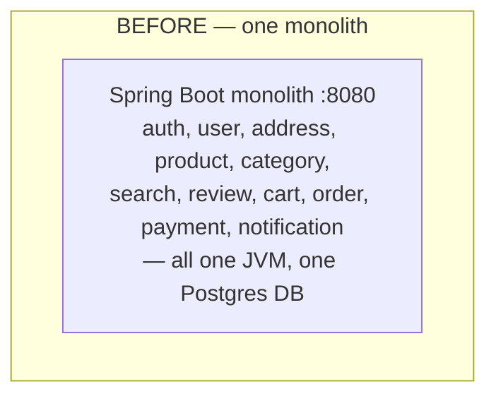
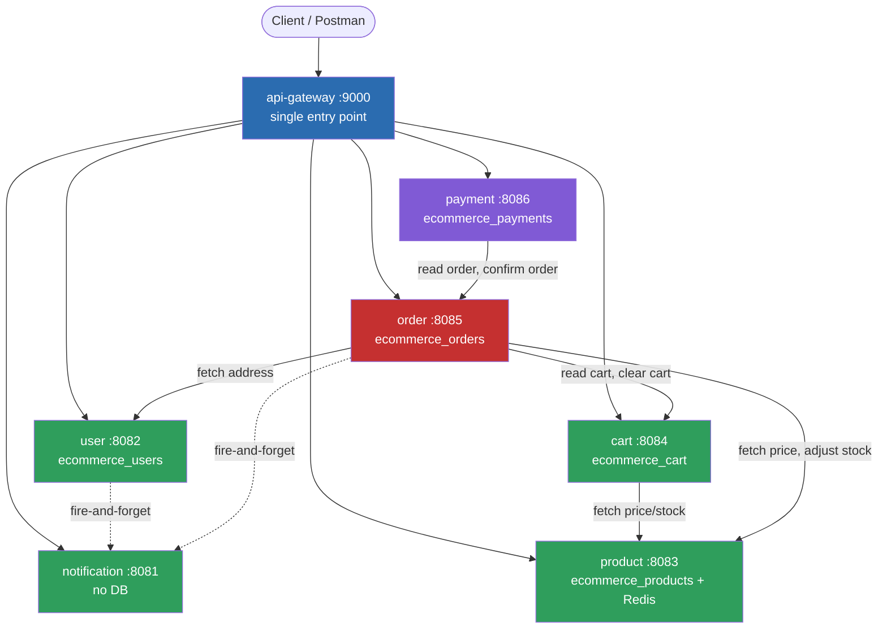
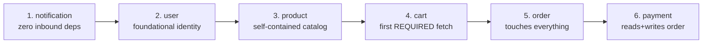
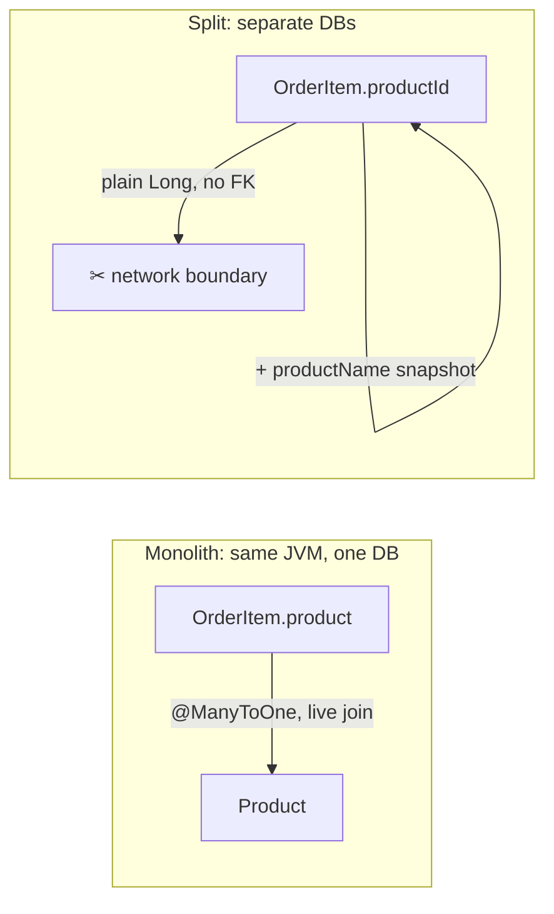
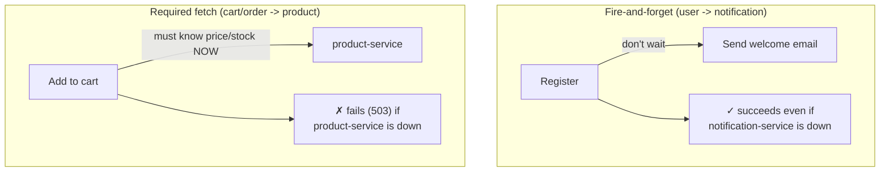
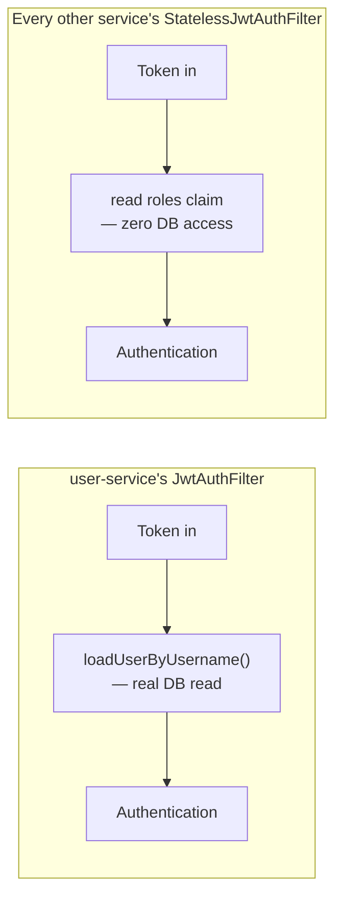
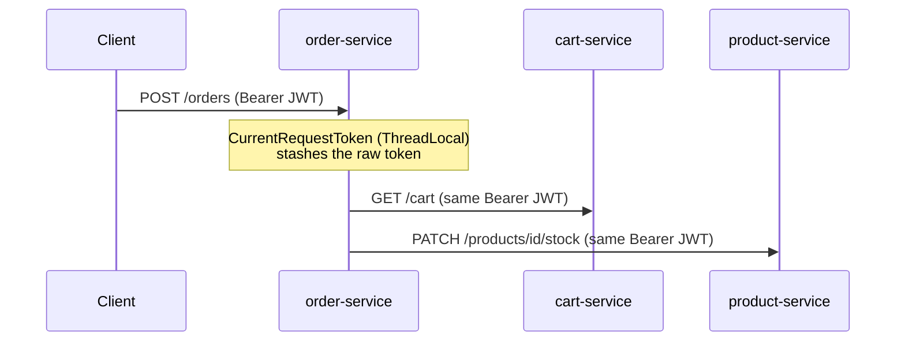
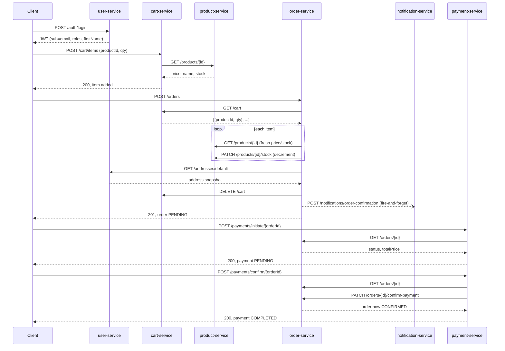
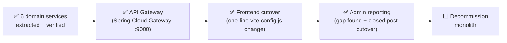

# ShopEase: Monolith → Microservices Migration

**Status**: All 6 domain services extracted, the API Gateway is live, the frontend is cut over (verified in an actual browser, full golden path), AND the one gap the cutover exposed — admin reporting — is closed. Only monolith decommission remains.
**Companion reading**: [phases/Phase-16-Microservices-Intro.md](phases/Phase-16-Microservices-Intro.md) is the step-by-step build log (what we did, in order, as we did it). *This* document is the synthesized end-to-end picture — read this first, use that one for build-time detail.

---

## 1. Before → After





**The monolith is still there, untouched, on :8080** — nothing has been deleted. This whole stack is a parallel system, verified to work end-to-end through the gateway, not yet wired to real traffic (frontend still points at the monolith).

| # | Service | Port | Database | Depends on |
|---|---|---|---|---|
| — | **api-gateway** | **9000** | *(none — pure router, WebFlux/Netty)* | routes to all 6 below |
| 1 | notification | 8081 | *(none — stateless)* | — |
| 2 | user | 8082 | ecommerce_users | notification (fire-and-forget) |
| 3 | product | 8083 | ecommerce_products | Redis (optional cache, slot 1) |
| 4 | cart | 8084 | ecommerce_cart | product (required fetch) |
| 5 | order | 8085 | ecommerce_orders | cart, product, user, notification |
| 6 | payment | 8086 | ecommerce_payments | order |

All 6 share one Postgres **instance**, each with its own **database** — logically isolated (no cross-database FK is even possible in Postgres), cheap to run locally, graduates to separate RDS instances later with only a `DB_URL` change.

---

## 2. Extraction order — leaf-first, hardest last



Each step only introduced **one new hard idea** on top of the previous ones:

| Step | New idea introduced |
|---|---|
| notification | own pom/port/Dockerfile — prove the mechanics with zero data risk |
| user | real database-per-service decision; JWT issuance |
| product | **stateless** JWT validation (no DB lookup) — the first non-issuing service |
| cart | a **required** cross-service fetch (vs. notification's fire-and-forget) |
| order | forwarding the caller's own JWT to 3 other services; snapshotting historical data |
| payment | reading AND writing another service's state over HTTP |

---

## 3. The four patterns that repeat across every service

### Pattern A — Entity FK → ID reference (+ snapshot for history)



Applied everywhere an entity pointed at another domain's table: `Cart.user`→`userEmail`, `CartItem.product`→`productId`+snapshot, `Order.user`→`userEmail`, `Order.shippingAddress`→5 snapshot columns, `OrderItem.product`→`productId`+`productName`, `Review.user`→`userId`, `Payment.order`→`orderId`.

**Rule of thumb used**: if the data is *historical* (an order, a payment — "what did this look like at the time?"), snapshot it. If it's just *current state* (a cart, a live product listing), fetch fresh instead of storing a copy.

### Pattern B — Fire-and-forget vs. required fetch



Every cross-service call is one or the other — never ambiguous. Fire-and-forget calls are wrapped in try/catch and logged on failure; required calls are allowed to propagate as a clean `503`.

### Pattern C — Two different JWT filters, on purpose



user-service owns the `users` table, so re-checking "is this account still enabled?" on every request is a legitimate, cheap local read. No other service has that table — they couldn't make that check even if they wanted to, so they trust the token's `roles` claim directly. Staleness trade-off: a disabled account stays valid elsewhere until the token expires (≤24h).

### Pattern D — Token forwarding (acting *as* the customer)



order-service and payment-service have no identity of their own — they don't have a "service account." Every outgoing call reuses the *customer's* token, so downstream services validate it exactly like a direct customer request. Known gap: nothing yet distinguishes "order-service calling on a customer's behalf" from "that customer calling directly" — a real system would add a service credential or mTLS here (see §5).

---

## 4. Full request lifecycle: placing and paying for an order



One purchase = **9 inter-service calls** across 6 processes. Verified exactly this way, live, via `verify-services.sh flow`.

---

## 5. Known gaps — stated plainly, not hidden

| Gap | Where it shows up | Real fix (not done here) |
|---|---|---|
| No distributed transaction | order-service decrements stock via HTTP, then writes its own DB — if the DB write fails after, stock doesn't roll back | Saga / compensating-action pattern (Phase 17+) |
| No service identity | `PATCH /products/{id}/stock` and `/orders/{id}/confirm-payment` accept *any* valid customer JWT, not just "order-service acting on someone's behalf" | Service credentials, mTLS, or a gateway-issued internal token |
| No service discovery | every service finds the others via a hardcoded `base-url` in `application.properties` (overridable by env var) | Eureka/Consul — deliberately deferred until multiple instances/dynamic scaling actually exist |
| Gateway is a second reactive stack | `api-gateway` runs WebFlux/Netty; the other 6 run Servlet/Tomcat — two different threading models in one system now | Accepted as-is — it's what "Spring Cloud Gateway" means by default; a blocking `spring-cloud-starter-gateway-mvc` variant exists if this ever needs to change |
| No message queue | every cross-service call is synchronous HTTP, including "fire-and-forget" ones (which just don't check the response) | Kafka/RabbitMQ — explicitly Phase 17, not Phase 16 |
| Redis cache key collision (avoided, not solved generally) | product-service uses Redis logical DB slot 1 so it doesn't collide with the monolith's slot 0 | Fine for 2 consumers; a real fix is namespacing cache keys per service |

---

## 6. What's actually left



- **API Gateway** — ✅ done. Single entry point on `:9000` in front of all 6 services, pure routing (no JWT validation there — every service still checks its own, unchanged). Verified live: the full login → category → product → cart → order chain works identically through the gateway as it does hitting each port directly.
- **Frontend cutover** — ✅ done. The React app never called a hardcoded host — `axios.js` uses `baseURL: '/api'`, and in dev that resolves through Vite's own proxy (`vite.config.js`). The *entire* cutover was one line: `server.proxy['/api'].target` from `http://localhost:8080` (monolith) to `http://localhost:9000` (gateway). Zero changes to any component or any `api/*.js` file. Verified in an actual browser: login → browse products → add to cart → place order, end to end, rendering a real order confirmation page (Order #9, PENDING, correct items/total) sourced entirely from the microservices.
- **Admin reporting** — ✅ done, and it's the best proof yet that cutting over to the gateway was worth doing *before* declaring victory: it immediately surfaced `/api/admin/dashboard` returning a live `404`, a route the monolith had that nothing in the new stack replicated. Closed by adding it to order-service (owns 4 of the 5 routes' data directly) plus two tiny count endpoints on product-service/user-service. Along the way, hit and fixed the *exact same* Hibernate 6/Postgres null-parameter bug documented in `problems-overcomed.md` #12 — this time in an admin order-filter query instead of product search. Full story: [phases/Phase-16-Microservices-Intro.md](phases/Phase-16-Microservices-Intro.md) §16.8.
- **Decommission the monolith** — the only remaining step. The monolith at `:8080` is still running, untouched, as a rollback path (revert the one proxy line to go back to it instantly).

Explicitly **not** part of this phase (per the project's own roadmap): Kafka/event-driven messaging (Phase 17), CQRS/event sourcing (Phase 18), Kubernetes (Phase 19).

---

## 7. How to verify any of this yourself

```bash
./verify-services.sh status        # what's up right now
./verify-services.sh start all      # start everything, waits for health
./verify-services.sh flow           # the 11-check end-to-end purchase chain
./verify-services.sh stop all       # clean shutdown
```

See [verify-services.sh](../verify-services.sh) — self-documenting, and built to grow with one line per new service.
