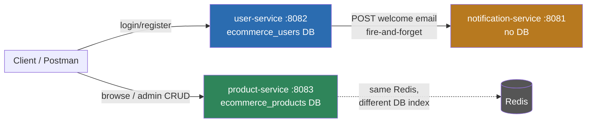
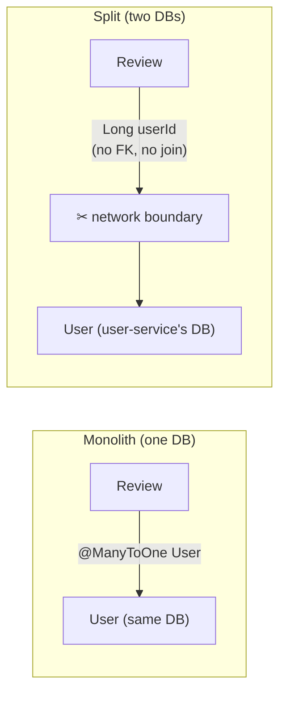
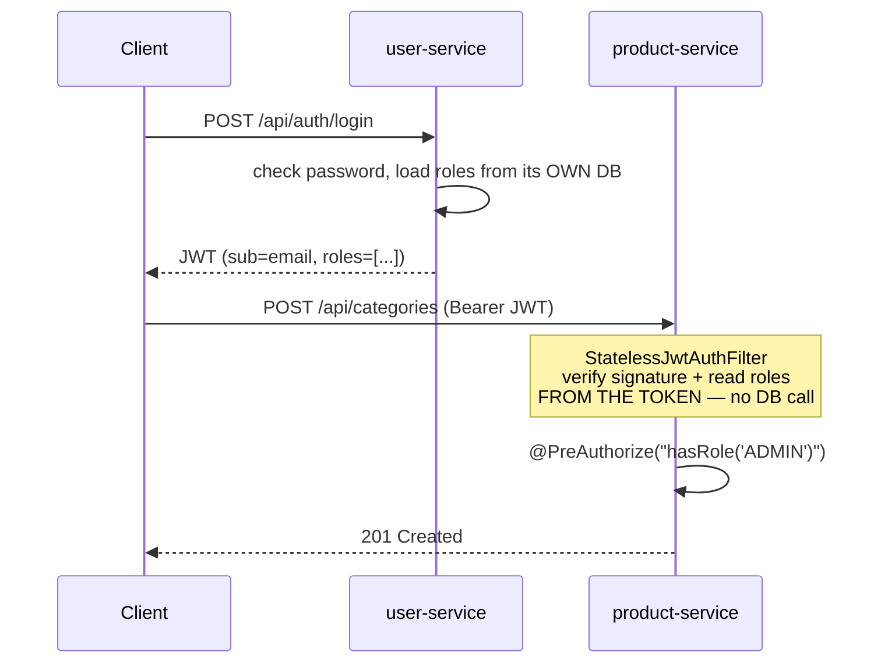
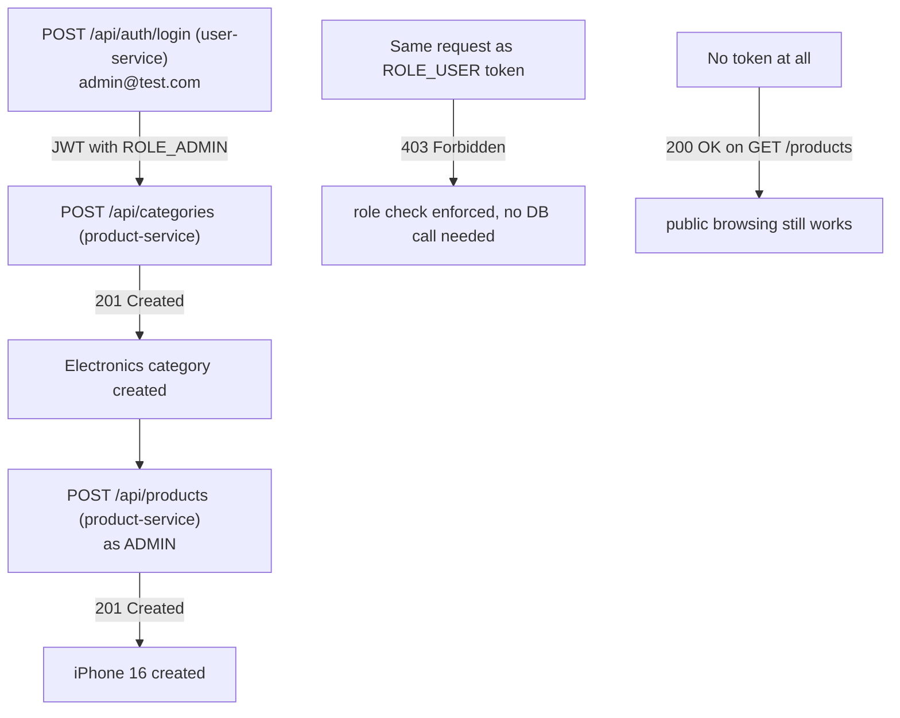

# Phase 16 — Microservices Intro: Service Decomposition

## Objective
Take the monolith apart, one bounded context at a time, without ever breaking the working system. This phase is a series of extractions (16.1, 16.2, ...) — each one takes a package out of the monolith and turns it into an independently buildable, independently runnable Spring Boot application, in strangler-fig order (safest/most-decoupled domain first, most-coupled domain last).

The monolith itself is untouched throughout — it stays at the repo root exactly as Phases 0–15 left it, still fully buildable and runnable, so it remains the reference implementation to compare each extracted service against.

---

## 16.1 — notification-service (first extraction)

### Why this one first
Every other domain (cart, order, payment...) is reachable by a browser and needs its own auth, its own DB, its own request/response contract. `notification` was the one domain in the whole monolith with **zero inbound HTTP API and zero owned database table** — Phase 11 built it as a pure `@Async` fire-and-forget helper called *from inside* other services. That makes it the cheapest possible place to first prove out "new pom, new Application class, new port, new Dockerfile" before doing it somewhere that actually has data-coupling risk.

### What We Built
| File | Purpose |
|---|---|
| `notification-service/pom.xml` | Standalone Maven project — same `spring-boot-starter-parent`, no dependency on the monolith's pom or any shared module |
| `NotificationServiceApplication.java` | New `@SpringBootApplication` entry point — this service's own JVM process |
| `config/AsyncConfig.java` | Identical thread pool to the monolith's (`core=2, max=5, queue=100, prefix=email-`) — the reasoning (ADR B-11) didn't change just because it moved |
| `EmailService.java` | Same 4 email methods, **adapted signatures** (see below) |
| `NotificationController.java` | New — REST endpoints so another service can trigger an email over HTTP |
| `dto/OrderConfirmationRequest.java`, `OrderItemLine.java`, `OrderCancellationRequest.java`, `WelcomeRequest.java`, `LowStockAlertRequest.java` | New — the DTOs that replace passing JPA entities across the boundary |
| `application.properties` | Own port `8081`, own context path `/notification` |
| `Dockerfile` | Same multi-stage build/run pattern as the monolith's |
| `templates/emails/*.html` | Same 3 Thymeleaf templates, field paths updated (see below) |

### The core problem this extraction forces you to solve: entity coupling → DTO coupling

In the monolith, `OrderService` called `emailService.sendOrderConfirmation(user, order)` **in the same JVM**, passing live Hibernate entities. `EmailService` could freely call `order.getItems()`, `order.getCreatedAt()`, `user.getFirstName()` because everything shared one process and one persistence context.

The moment `notification-service` becomes its own process, that's impossible:
- It has no `spring-boot-starter-data-jpa`, no Postgres/H2 driver — **no database connection at all**.
- It doesn't have the `Order`/`User`/`OrderItem` classes on its classpath — those entity definitions live in the monolith (and later, in order-service/user-service).

So every method's signature changed from "take an entity" to "take a flat DTO":

```java
// Before (monolith, same JVM):
emailService.sendOrderConfirmation(user, order);
// EmailService reaches into order.getItems(), user.getFirstName(), etc.

// After (separate process):
emailService.sendOrderConfirmation(new OrderConfirmationRequest(
    user.getEmail(), user.getFirstName(), order.getId(),
    order.getStatus().name(), order.getTotalPrice(),
    order.getItems().stream()
        .map(i -> new OrderItemLine(i.getProduct().getName(), i.getQuantity(), i.getPriceAtPurchase()))
        .toList(),
    order.getCreatedAt()
));
```

**This is the pattern for every future extraction, not just this one.** Wherever there used to be an in-process method call passing an entity, there is now an HTTP call (for now — an event, once Phase 17 introduces Kafka) passing a DTO. cart-service calling product-service for a price, order-service calling user-service for an address — same shape of change every time.

The Thymeleaf templates needed one small update to match: `item.product.name` (entity navigation) became `item.productName` (flat DTO field) in `order-confirmation.html`. Nothing else about the templates changed.

### Which database does it use?
**None.** This is worth stating explicitly because it's the exception, not the rule, going forward. `notification-service`'s `pom.xml` has no `spring-boot-starter-data-jpa` and no DB driver; `application.properties` has no `spring.datasource.*`. It is fully stateless — receive request → render template → send SMTP → done. There is no "notifications" table logging history (a real system might add one later, e.g. "has this user opened this email" — out of scope here).

This was only possible because `notification` was the one domain with zero owned tables in the ADR B-01 boundary map. Every extraction after this one (**user-service** next) owns real tables, so "what's the database story?" becomes an actual decision instead of a non-question — see Phase 16.2 for how that gets resolved.

### Auth
Deliberately **none** on `NotificationController`. These endpoints are called by other services (order-service, once it exists), not by a browser — there's no end user JWT to validate. Locking down service-to-service calls (a shared internal token, mTLS, or simply "not internet-routable") is a hardening step, not something the first extraction needs to solve. Flagged here so it isn't mistaken for an oversight later.

### How we verified it (not just "it compiles")
```bash
cd notification-service
../mvnw compile              # clean compile, zero errors
../mvnw package -DskipTests  # → target/notification-service-0.0.1-SNAPSHOT.jar (~26MB)
java -jar target/notification-service-0.0.1-SNAPSHOT.jar   # started standalone on :8081

curl http://localhost:8081/notification/actuator/health
# → {"status":"UP"}

curl -X POST http://localhost:8081/notification/api/notifications/welcome \
  -H "Content-Type: application/json" \
  -d '{"recipientEmail":"test@example.com","firstName":"Kalyan"}'
# → HTTP 202 Accepted
```
Log output after the POST:
```
INFO  ... Tomcat started on port 8081 (http) with context path '/notification'
INFO  ... Started NotificationServiceApplication in 4.363 seconds
ERROR ... [email-1] EmailService : Failed to send welcome email to test@example.com: Authentication failed
```
Three things this proves at once:
1. **202 immediately** — the controller returned before the email attempt even started (async is working).
2. **Thread named `email-1`** — the custom `ThreadPoolTaskExecutor` from `AsyncConfig` is the one actually running the task, not Spring's default `SimpleAsyncTaskExecutor`.
3. **Failure isolated** — the fake Gmail credentials caused an `Authentication failed` error that was caught and logged, not thrown — exactly the "email failure must never fail the caller" behavior from Phase 11, now proven to survive the move into a separate service.

### Common Bugs / Gotchas Hit During This Extraction
| Bug | Cause | Fix |
|---|---|---|
| `cd notification-service && ...` then next command "file not found" | Shell working directory persists across tool calls — a `cd` in one command carries into the next | Always confirm `pwd` before assuming you're at repo root again |
| None yet on the Spring side | — | This extraction had no Spring-specific surprises — the monolith's own `AsyncConfig`/`EmailService` design ported over cleanly once entities were replaced with DTOs |

---

## Interview Questions

**Q: Why extract the "notification" domain first instead of something like "user" or "product"?**
> Strangler-fig migrations should extract the least-coupled, lowest-risk piece first to prove the mechanics (build, deploy, verify) before tackling anything with real data dependencies. Notification had zero inbound callers other than internal method calls and zero owned database tables — the smallest possible blast radius if something went wrong.

**Q: Does every microservice need its own database?**
> No — only services that own persistent state need one. A purely stateless service (an email sender, a PDF renderer, a notification dispatcher, often an API gateway) has nothing to persist and needs no database at all. The "database per service" rule applies to services that own data, not to every service unconditionally.

**Q: What changes when a synchronous in-process call becomes a cross-service call?**
> The caller can no longer pass a live object graph (a Hibernate entity with lazy-loaded relationships tied to an open persistence context) — that context doesn't exist on the other side of a network call. The callee's public contract must become a flat, serializable DTO containing exactly the fields it needs, and the caller becomes responsible for assembling that DTO from its own data before making the call.

**Q: If this were re-done with Kafka (Phase 17) instead of REST, what would actually change?**
> Only the transport at the very edges: `NotificationController`'s REST endpoints would be replaced by a `@KafkaListener` consuming `OrderPlaced`/`OrderCancelled`/`UserRegistered` events, and callers would publish an event instead of issuing an HTTP POST. `EmailService` and every DTO underneath stay identical — the DTO *is* the event payload shape. This is why getting the DTO boundary right now matters even before messaging exists.

---

## MFAQ

**Why does `notification-service` still have `spring-boot-starter-validation` if nothing calls it from a browser?**
The DTOs (`@Email`, `@NotBlank`, `@Min`) still get validated on every request, because the caller is still an untrusted-enough boundary (a bug in order-service could send a malformed payload) — validation isn't only for end users, it's for any network boundary.

**Won't copying `AsyncConfig` and the templates verbatim cause drift from the monolith's copies over time?**
Yes, and that's expected and fine for now — the monolith's copy will eventually be deleted once every domain that emails things (auth, order) is extracted and pointed at this service instead. Until then, two copies temporarily existing is the normal, visible cost of a strangler-fig migration — not a mistake to "fix" by linking them together.

**What's next?**
Phase 16.2 — **user-service** (`auth` + `user` + `address`). This is the first extraction that owns real tables, so it's where "which database, and how many" becomes a real decision instead of a non-question.

---

## 16.2 — user-service (first extraction with real data + a real inter-service call)

### Why this one next
Notification proved the mechanics (own pom, own port, own Dockerfile) with zero data risk. `user` is the next-safest step up: it owns real tables, but nothing else in the monolith writes to `users`/`roles`/`addresses` — everything else only *reads* a user by ID. It's also foundational: every future service (cart, order, payment) needs to know who's calling, so identity has to exist before those can be extracted.

### The database decision
Chose: **same Postgres container/instance as the monolith, but a separate database** — `ecommerce_users`, created with `CREATE DATABASE ecommerce_users` against the existing container. Not a new schema inside the monolith's `ecommerce_dev` database (that would still allow accidental cross-service JOINs), and not a whole second Postgres container yet (that's the AWS-time upgrade). This is the deliberate middle step: fully isolated at the database level (no shared tables, no cross-database FK — Postgres doesn't even allow FKs across databases), cheap locally (one running Postgres process), and it graduates cleanly to a separate RDS instance later without any code change — only the `DB_URL` env var changes.

```bash
# One-time setup, run once against the existing Postgres:
psql -h localhost -U postgres -d postgres -c "CREATE DATABASE ecommerce_users"
```

### What We Built
| File | Purpose |
|---|---|
| `user-service/pom.xml` | Standalone Maven project, own parent, own DB driver |
| `UserServiceApplication.java` | New entry point, `@EnableJpaAuditing` (needed for `Auditable`'s `@CreatedDate`/`@LastModifiedDate`) |
| `user/User.java`, `Role.java`, `RoleRepository.java`, `UserRepository.java`, `UserDetailsServiceImpl.java` | Copied verbatim — fully self-contained, no cross-package monolith references |
| `address/Address.java`, `AddressRepository.java` | Copied verbatim — `Address` belongs to `User`, both now live in the same service |
| `auth/AuthController.java`, `dto/*` | Copied verbatim — the public contract (`POST /api/auth/register`, `POST /api/auth/login`) is unchanged |
| `auth/AuthService.java` | **Adapted** — see below |
| `notification/NotificationClient.java` | New — the piece that replaces the in-process email call |
| `config/{SecurityConfig, JwtAuthFilter, DevController, DataSeeder}` | Copied, trimmed to only what this service owns (no `/products`, `/categories` in `PUBLIC_URLS`; `DataSeeder` seeds only roles + demo users, not products) |
| `common/{audit, exception, response, util}` | Copied verbatim (same reasoning as notification-service's copies) |

### The second real adaptation: a synchronous cross-service call

The monolith's `AuthService.register()` called `emailService.sendWelcome(user)` **in the same JVM** — no network involved, entity in, nothing back. Now that `EmailService` lives inside `notification-service`, that call has to leave the process:

```java
// Before (monolith):
emailService.sendWelcome(user);   // in-process method call, takes the entity

// After (user-service -> notification-service, over HTTP):
notificationClient.sendWelcome(user.getEmail(), user.getFirstName());
```

`NotificationClient` wraps Spring's `RestClient` (the modern synchronous HTTP client, Spring Framework 6.1+/Boot 3.2+ — the direct replacement for the older `RestTemplate`, which you'll still see everywhere in existing codebases and interview questions). It does a `POST /api/notifications/welcome` against `notification-service`'s own `NotificationController` — the exact endpoint built in 16.1.

Same non-negotiable rule as Phase 11's `@Async` (ADR B-11), now one network hop further out: **if notification-service is down, registration must still succeed.** The call is wrapped in try/catch, logs on failure, and never propagates — the alternative (a hiccup in an unrelated service breaking your core registration flow) is the exact fragility a synchronous inter-service call introduces, and exactly the reason Phase 17 eventually replaces this call with a published event instead of an HTTP request.

One thing deliberately **not** carried over: `MetricsService.incrementRegistrations()`. Cross-service metrics aggregation (one Prometheus/Grafana view spanning every microservice) is a real, valid question — but it's infrastructure that should be solved once, consistently, not half-solved inside one service's business logic while extracting it. Deferred to when observability itself gets revisited, not dropped by oversight.

### JWT: still validated by looking the user up in the DB — for now
`JwtAuthFilter` in user-service is unchanged from the monolith: on every request it calls `userDetailsService.loadUserByUsername(username)`, i.e. a DB read, to rebuild the `UserDetails` and confirm the account is still enabled. That's correct and cheap **here**, because user-service owns the `users` table.

It will NOT be correct for the next services (cart, order, ...). Those services don't have a `users` table at all, so they can't do this lookup even if they wanted to — the JWT's `roles` claim (already embedded at token-issue time, see `JwtUtil.generateToken`) is the only identity information they'll have, and they'll need to trust it directly rather than calling back into user-service on every single request just to re-derive what the token already says. Flagging this now so the *next* extraction's `JwtAuthFilter` is a deliberate rewrite, not confusion about why it looks different from this one.

### How we verified it
```bash
# One-time: create the database (see above), then:
cd user-service && ../mvnw package -DskipTests
java -jar target/user-service-0.0.1-SNAPSHOT.jar     # :8082, alongside notification-service on :8081

curl -X POST http://localhost:8082/api/auth/register \
  -H "Content-Type: application/json" \
  -d '{"firstName":"Kalyan","lastName":"Test","email":"kalyan-test@example.com","password":"secret123"}'
# -> 201, real JWT returned

# user-service log:
#   INFO  AuthService : New user registered: kalyan-test@example.com
# notification-service log (proves the HTTP call actually landed):
#   ERROR [email-1] EmailService : Failed to send welcome email to kalyan-test@example.com: Authentication failed
#   (fails only on the fake Gmail creds -- same expected failure mode as 16.1)

# JWT gate check:
curl http://localhost:8082/api/some-protected-path                              # -> 403 (no token)
curl -H "Authorization: Bearer <token>" http://localhost:8082/api/some-protected-path  # passes auth,
#   log shows "Authenticated user: kalyan-test@example.com" BEFORE the 500 --
#   the 500 itself is NoResourceFoundException falling into the catch-all
#   Exception handler, a pre-existing monolith quirk (same GlobalExceptionHandler
#   code, unchanged), not something this extraction introduced.

curl http://localhost:8082/api/dev/users
# -> admin@test.com (ROLE_ADMIN), user@test.com (ROLE_USER), kalyan-test@example.com (ROLE_USER)
# proves DataSeeder ran correctly against the new ecommerce_users database
```

### Common Bugs / Gotchas Hit During This Extraction
| Bug | Cause | Fix |
|---|---|---|
| No `psql` client available locally | Postgres runs via a container/service with no CLI installed on the host | Used the `postgresql-42.7.3.jar` driver already cached in `~/.m2` to run `CREATE DATABASE` via a throwaway JDBC snippet — no new tooling installed |
| `NoResourceFoundException` -> 500 instead of 404 on an unmapped path | Pre-existing: `GlobalExceptionHandler`'s catch-all `@ExceptionHandler(Exception.class)` doesn't special-case Spring's resource-not-found exception | Not fixed here — identical behavior exists in the monolith today; noted rather than silently carried forward unexplained |

---

## Interview Questions (16.2)

**Q: Why put user-service's data in a new database inside the same Postgres container instead of a new schema, or a whole new container?**
> A new schema in the same database still shares one Postgres instance's failure domain and makes it *possible* (even if not intended) to write a cross-schema JOIN, silently re-coupling two services. A separate database on the same server gives real logical isolation — Postgres cannot FK or JOIN across databases — while deferring the operational cost of a second container/instance until it's actually justified (e.g. before a cloud deployment).

**Q: What's the risk of a synchronous HTTP call from user-service to notification-service on the registration path?**
> If notification-service is slow or down, the call either blocks the registration request or fails. It's wrapped in try/catch specifically so failure doesn't propagate — but the registration response is still, in principle, waiting on a second service's availability for that brief window. This latent coupling is exactly why event-driven communication (Phase 17) is preferred for this kind of "fire-and-forget, best-effort" work in a mature system — the caller shouldn't need the callee to be reachable at all.

**Q: Why does user-service's JwtAuthFilter still do a database lookup on every request, when the JWT already contains the roles claim?**
> Because user-service owns the `users` table, so re-checking `enabled` (has this account been disabled since the token was issued?) is a legitimate, cheap, same-database read. A service that does NOT own that table can't make this same choice — it would mean a network call to user-service on every single authenticated request just to answer a question the token can already answer well enough. That trade-off (freshness vs. an extra network hop per request) is exactly why the *next* service's filter needs to look different, not the same.

---

## MFAQ (16.2)

**Why does `DataSeeder` only seed roles and two demo users here, when the monolith's version also seeded products and categories?**
Because this service doesn't own products or categories — that seeding logic belongs in `product-service` once that extraction happens. Splitting `DataSeeder` along the same lines as the package split keeps each service's seed data scoped to what it actually owns.

**If user-service is down, can anything else in the system still function?**
Right now: yes, for anything that doesn't require login (there's nothing else built yet to test this against, but the shape of the answer matters) — existing JWTs already issued keep working anywhere else that validates them independently, since validation is just a signature+claims check, not a call back to user-service. This is the JWT/stateless-auth payoff (ADR B-04) showing up concretely for the first time in the split system.

**What's next?**
Phase 16.3 — **product-service** (`product` + `category` + `search` + `review`). Fully self-contained catalog data, no writes depend on user-service or anything else — the last "easy" extraction before cart-service, which will be the first to make an inter-service call to *fetch* data (product price/name) rather than just fire-and-forget notify.

---

## 16.3 — product-service (product + category + search + review)

### System so far



Monolith (port 8080) still runs untouched alongside all three — nothing above replaces it yet.

### The one real fix this extraction needed: `Review.user`



Everything else in `product`/`category`/`search` was self-contained and copied unchanged.

### The bigger lesson: two different JWT filters, on purpose



| | user-service's `JwtAuthFilter` | product-service's `StatelessJwtAuthFilter` |
|---|---|---|
| Checks | DB (`loadUserByUsername`) | Token claims only |
| Why | It owns the `users` table — cheap, catches disabled accounts instantly | Owns no `users` table — can't check even if it wanted to |
| Cost | One DB read per request | Zero extra I/O per request |
| Staleness | None | Up to token expiry (24h) if an account gets disabled |

### Other decisions, briefly
- **DB**: `ecommerce_products`, same Postgres instance, separate database (same pattern as 16.2).
- **Redis**: shared instance with the monolith, but `spring.data.redis.database=1` — a different logical DB slot, so cache keys (`products::all`, `category::5`...) don't collide with the monolith's own cache on slot 0.
- **Redis down entirely?** App still starts and works — `management.health.redis.enabled=false` added, since caching here is an optimization (ADR B-10), not a hard dependency.

### Verified live (all three services running together)



All five outcomes above were hit exactly as shown — 201 / 201 / 403 / 200, in one live run across three separate JVMs.

### What's next?
Phase 16.4 — **cart-service**. First service that needs to *fetch* data from another service mid-request (product price + name from product-service) rather than fire-and-forget notify — a different, harder integration shape than anything built so far.
